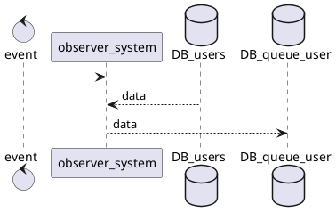
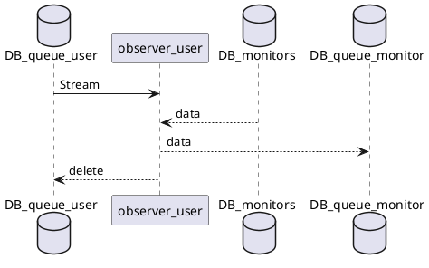
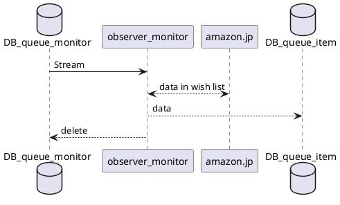
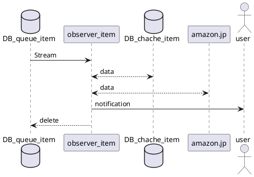

# design

## data model

```text
/users/{}

user_id: "string"
notification: 
    type: "slack"
    incoming_web_hook: "string"
    slack_channel: "string"

/users/{}/monitors/{}

monitor_id: "string"
user_id: "string"
wish_list_url: "string"
threshold:
    points: int
    discount_rate: int
    
/system/queues/users/{}

user_id: "string"
ttl: int
notification: 
    type: "slack"
    incoming_web_hook: "string"
    slack_channel: "string"

/system/queues/monitors/{}

monitor_id: "string"
user_id: "string"
ttl: int
wish_list_url: "string"
threshold:
    points: int
    discount_rate: int
notification: 
    type: "slack"
    incoming_web_hook: "string"
    slack_channel: "string"

/system/queues/items/{}

queue_id: "string"
item_url: "string"
ttl: int
threshold:
    points: int
    discount_rate: int
notification: 
    type: "slack"
    incoming_web_hook: "string"
    slack_channel: "string"


```

## flow

### scheduled event



### DB_queue_user




### DB_queue_monitor




### DB_queue_item




