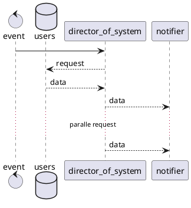
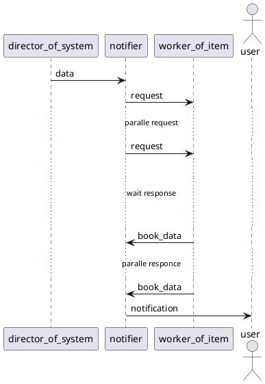
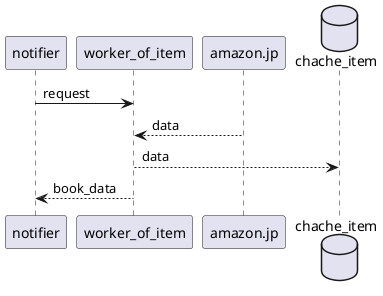

# design

## data model

### `/users/{}`

```yaml
user_id: string(Hash Key)
monitors:
    -
    wish_list_url: string
    threshold:
        points: int
        discount_rate: int
    notification:
        type: "slack"
        incoming_web_hook: string
        slack_channel: string
    -
    wish_list_url: string
    threshold:
        points: int
        discount_rate: int
    notification:
        type: "slack"
        incoming_web_hook: string
        slack_channel: string
```

### `/items/{}`

```yaml
'url': url
'book_title': book_title
'latest':
    'discount_rate': discount_rate
    'discount_price': discount_price
    'loyalty_points': loyalty_points
    'price': price
    'updated': time
'best':
    'discount_rate': discount_rate
    'discount_price': discount_price
    'loyalty_points': loyalty_points
    'price': price
    'updated': time

```

## flow

### director_of_system


``

### notifier




### worker_of_item




