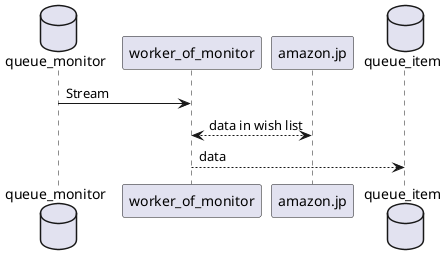
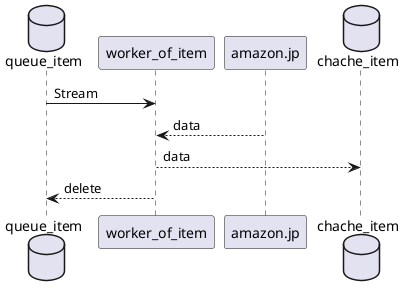

# design

## data model

### `/users/{}`

```yaml
user_id: string(Hash Key)
monitors:
    - 
    wish_list_url: string
    threshold:
        points: int
        discount_rate: int
    notification: 
        type: "slack"
        incoming_web_hook: string
        slack_channel: string
    - 
    wish_list_url: string
    threshold:
        points: int
        discount_rate: int
    notification: 
        type: "slack"
        incoming_web_hook: string
        slack_channel: string       
```

### `/system/queues/monitors/{}`

```yaml
wish_list_url: string(Hash Key)
user_id: string(Sort Key)
expired: int(TTL)
threshold:
    points: int
    discount_rate: int
notification: 
    type: "slack"
    incoming_web_hook: string
    slack_channel: string
item_urls:
    - "string"
    - "string"
    - "string"
```

これがdeleteされたら

### `/system/queues/items/{}`

```yaml
item_url: string(Hash Key)
expired: int(TTL)
```


## flow

### [x] director_of_system


### [ ] worker_of_monitor



### [ ] notifier


### [ ] worker_of_item




